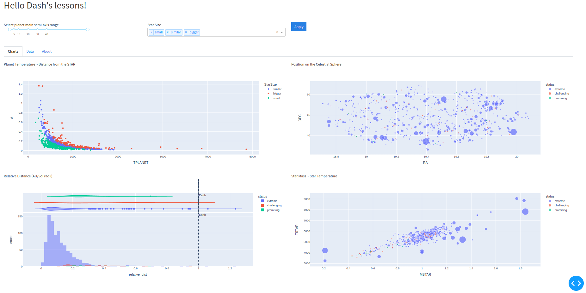
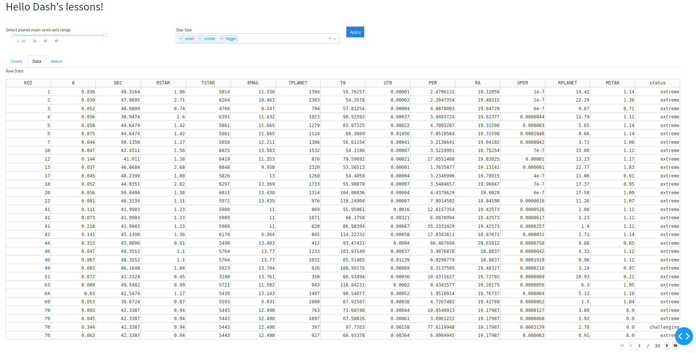
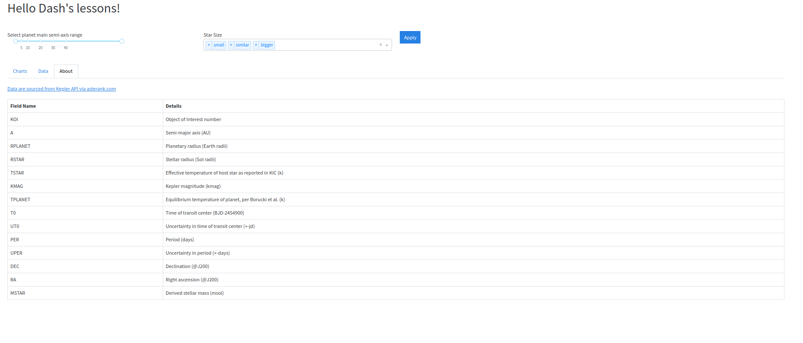

# Изучение библиотеки python **Dash**
### Урок #12: добавили описание данных.

:tv: Видео [Plotly Dash #12][1]

1. **Documents** [Dash Plotly](https://dash.plotly.com/layout)
2. **Youtube playlist** [Plotly Dash - 🚀дашборд в Python🐍](https://www.youtube.com/watch?v=HExq59HlFb0&list=PLIAV3wuAPHZouwZlmvqmC-djRsaDKT8rC&index=1)

---
####  Урок #12
Tab Charts

Tab Data

Tab About

[1]: https://www.youtube.com/watch?v=dNxbtwTTm-Q&list=PLIAV3wuAPHZouwZlmvqmC-djRsaDKT8rC&index=12
